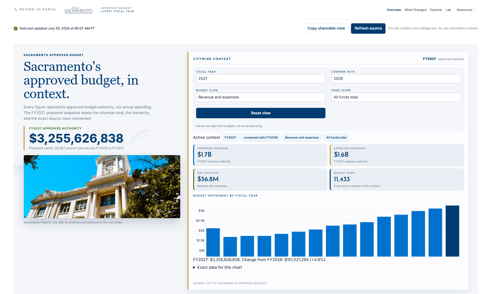

# Sacramento Budget Atlas

Sacramento Budget Atlas is an unofficial, local desktop-first Shiny for Python
proof of concept for exploring City of Sacramento approved budget records. It
keeps the Budget pilot shell and adds a Civic Budget Story Studio opening stage
that connects narrative context, filters, key figures, trends, and supporting
records.

**Status:** local proof of concept with a reviewed, time-limited Azure public-pilot
deployment route. The pilot identity bootstrap is deployed, but no Budget Atlas
Container App or image is deployed. This project is not a City-approved public
release, official City communication, or production deployment. The City data
owner and communications team have not approved the application, its
interpretation, or its visual assets.



## Features

- **Overview:** citywide approved revenue and expense totals, fiscal-year
  comparison, fund-scope views, movement over time, and a linked
  department-to-fund-to-category hierarchy.
- **What Changed:** compare fiscal years and review ranked approved-amount
  movements.
- **Explorer:** filter departments, funds, categories, fiscal years, flows, and
  fund scopes; inspect the exact supporting rows and ObjectId detail.
- **Lab:** run a clearly labeled allocation sandbox and review robust change and
  direction signals.
- **Budget 101:** read plain-language explanations and a guided path through
  the hierarchy.
- **Sources & Methods:** review the source contract, normalization, checks,
  reconciliation, fund-scope rules, and interpretation limits.
- **Shared interaction shell:** preserve selection context through hierarchy
  drilldown, detail drawers, browser navigation, and bookmark/share state.

## Data source and coverage

The application reads the City of Sacramento Approved Budgets ArcGIS feature
layer:

[City of Sacramento Approved Budgets FeatureServer layer](https://services5.arcgis.com/54falWtcpty3V47Z/arcgis/rest/services/City_of_Sacramento_Approved_Budgets/FeatureServer/0)

The source is live and can change. The local reference snapshot inspected on
July 29, 2026 contains 29,387 rows covering fiscal years 2013 through 2027.
Fiscal year 2027 contains 11,433 rows. These counts describe that prepared
snapshot, not a guarantee about future source responses.

Rows are requested in ascending `ObjectId` order, in pages of up to 1,000
records, then normalized before the application uses them. A refresh is
considered complete only after the full response is validated and prepared.

## Normalized data contract

The source boundary produces exactly eight canonical fields. The prepared
bundle adds an internal `fund_scope` classification for application views; it
is not part of this eight-field source contract.

| Field | Type | Meaning in this application |
| --- | --- | --- |
| `fiscal_year` | integer | Fiscal year from `Fiscal_Year` |
| `department` | string | Department from `Department` |
| `fund` | string | Fund name from `Fund` |
| `category` | string | Category from `CATEGORY` or `Category` |
| `amount` | number | Numeric amount from `Amount` |
| `expense_revenue` | string | `Expenses` or `Revenues`, normalized from `ExpenseRevenue` values such as `E` or `R` |
| `fund_category` | string | Source fund category from `Fund_Category` |
| `object_id` | integer | Source `ObjectId` identity used for exact-row lookup |

Text is whitespace-cleaned at the source boundary. Invalid numbers, missing
required fields, and unknown expense or revenue codes fail validation instead
of being silently inferred.

## Approved-authority meaning and limits

The application presents the source records as approved budget authority. An
approved amount is an amount in the approved budget record. It is not a measure
of actual spending, payments, encumbrances, audited results, a forecast, a
service outcome, or performance evidence.

The following limits apply to every view:

- The source can be edited after a local snapshot is prepared. Always check
  the displayed source timestamp and the live layer before relying on a number.
- Revenue and expense labels, amount sign interpretation, department and fund
  normalization, and fund-scope classification require data-owner review before
  leadership or public use.
- The allocation sandbox is hypothetical. It does not change the source and
  does not predict an adopted budget.
- The application is a single-process pilot. It has no production identity,
  access-control, multi-process refresh lease, or deployment claim.

## Architecture and cache behavior

The application opens the last complete prepared bundle before checking the
network. A process-wide `SnapshotStore` shares an immutable bundle across Shiny
sessions. A refresh fetches and normalizes all source pages, prepares aggregate
tables and indexes, validates row counts, years, hashes, and reconciliations,
then atomically promotes a new version. The prior valid version remains
available as a fallback when a refresh fails.

The default cache directory is `.cache/` and is ignored by version control. A
prepared cache has a `current.json` pointer and versioned snapshot directories
containing Parquet rows, choices, aggregate tables, metadata, and an artifact
manifest. The repository reuses a fresh in-memory or disk snapshot, checks the
ArcGIS edit timestamp after the cache TTL, and fetches pages when a new source
version is needed. The default TTL is 86,400 seconds (one day).

The application starts its process refresh in the background. Automatic
refresh is enabled by default. If a valid cache is present, it remains usable
while a replacement is fetched and validated. If the source is unavailable,
the last valid cache is served as stale data. With no valid cache and no source
response, the application shows its loading or unavailable state.

### First live refresh from a clean clone

Requirements: Python 3.12, [uv](https://docs.astral.sh/uv/), and network access
to the ArcGIS layer above.

From the repository root, run:

```powershell
uv sync --frozen
$env:BUDGET_CACHE_DIR = (Join-Path (Get-Location) ".cache")
$env:BUDGET_BACKGROUND_REFRESH_ENABLED = "1"
uv run shiny run --host 127.0.0.1 --port 8125 app.py
```

On a clean clone, `.cache/` does not exist. The first session starts with the
loading state while the enabled background refresh contacts ArcGIS and writes
the first prepared bundle. Keep the server running until the source status and
data timestamp appear. Open <http://127.0.0.1:8125/>.

### Deterministic cached demo mode

Use this mode only after a live run has created a valid prepared cache. The
guard below prevents starting the deterministic demo on an empty clone:

```powershell
if (-not (Test-Path ".cache/current.json")) {
  throw "No prepared cache found. Run the first live refresh first."
}
$env:BUDGET_CACHE_DIR = (Join-Path (Get-Location) ".cache")
$env:BUDGET_BACKGROUND_REFRESH_ENABLED = "0"
uv run shiny run --host 127.0.0.1 --port 8125 app.py
```

With `BUDGET_BACKGROUND_REFRESH_ENABLED=0`, automatic source refresh is off,
so the session remains deterministic against the existing cache. Manual source
refresh is disabled by default and must be enabled explicitly.

## Configuration

`budget_app/config.py` reads these environment variables:

| Variable | Default | Purpose |
| --- | --- | --- |
| `BUDGET_ARCGIS_URL` | The FeatureServer URL linked above | ArcGIS layer endpoint |
| `BUDGET_CACHE_DIR` | `<project root>/.cache` | Prepared bundle and compatibility cache location |
| `BUDGET_CACHE_TTL_SECONDS` | `86400` | Freshness window before source metadata is checked |
| `LOG_LEVEL` | `INFO` | Python logging level |
| `APP_BASE_PATH` | `/` | Shiny application base path, normalized with leading and trailing slashes |
| `APP_ALLOWED_HOSTS` | `localhost,127.0.0.1,testserver` | Comma-separated Host header allowlist; set deployed hostnames explicitly |
| `BUDGET_MANUAL_REFRESH_ENABLED` | `false` | Allow users to request source refreshes from the UI |
| `BUDGET_MANUAL_REFRESH_COOLDOWN_SECONDS` | `300` | Process-wide cooldown between manual source refreshes |
| `BUDGET_PREPARED_SCHEMA_VERSION` | `1` | Prepared-bundle schema version |

`BUDGET_BACKGROUND_REFRESH_ENABLED` is an application-level toggle in
`budget_app/application.py`, not a `Settings` field. Its default is enabled;
set it to `0`, `false`, or `no` to disable automatic background refresh for a
cached demo. `SHINY_TESTMODE=1` is used only by the local browser test fixtures.

## Docker

The image uses Python 3.12, the frozen `uv.lock`, port 8000, and a named volume
for `/var/cache/sacramento-budget`:

```sh
docker compose up --build
```

Open <http://127.0.0.1:8000/>. The first container run has an empty named
volume, so it needs network access for its initial ArcGIS refresh. Subsequent
runs reuse the volume. The container filesystem is read-only except for the
cache volume and a temporary filesystem at `/tmp`.

The container exposes `/health/live` for liveness and `/health/ready` for
traffic admission. Azure-specific topology, settings, and release gates are in
[`docs/azure-deployment-hardening.md`](docs/azure-deployment-hardening.md).

## Focused checks

The normal test configuration excludes tests marked `live` and `e2e`:

```sh
uv run ruff check --no-cache .
uv run pytest -p no:cacheprovider tests/test_config.py tests/test_data_normalize.py tests/test_data_domain.py tests/test_data_repository.py tests/test_prepared_bundle.py tests/test_snapshot_store.py tests/test_state.py tests/test_components.py tests/test_assets.py
```

The production ArcGIS contract test is opt-in and requires live network
access:

```sh
uv run pytest -p no:cacheprovider -m live tests/test_live_contract.py
```

Browser and lifecycle checks are marked `e2e` and require the local browser
fixture setup. See `tests/e2e/` and the validation notes in `docs/` before
running them.

## Repository layout

```text
.
|-- app.py                         # ASGI/Shiny entry point
|-- budget_app/                    # Configuration, data layer, state, and UI modules
|-- www/                           # CSS, JavaScript, fonts, and image assets
|-- tests/                         # Unit, contract, and opt-in browser tests
|-- docs/                          # Validation, source, cache, and provenance notes
|-- Dockerfile                     # Minimal production-shaped container image
|-- docker-compose.yml             # Local container runner with persistent cache
|-- pyproject.toml                 # Python metadata, dependencies, and test markers
`-- .cache/                        # Local prepared cache, created at runtime and ignored
```

`artifacts/`, `reference/`, logs, virtual environments, and test caches are
local evidence or runtime material. They are ignored or excluded from the
container build and are not required to run the application.

## Asset provenance and permissions

See [`docs/asset-provenance.md`](docs/asset-provenance.md) for the retrieval
date, source URLs, and local usage basis. In summary:

- `www/assets/COStreatmentBLUE.png` and the bundled fonts are inherited from
  the certified local Budget pilot and are retained for local proof-of-concept
  use.
- The Historic City Hall and Council Chambers photographs are sourced from
  City website URLs and are documentary context only. Permission for this
  local use remains to be confirmed.
- The river, civic ornament, and chroma-key source images are generated
  decorative artwork. They do not depict a real City building, person, seal,
  or source record, and they are hidden from assistive technology.

No asset statement above grants permission for public, campaign, leadership, or
production use.

## Repository access and reuse

This initial repository is private. No open-source license is included, and no
permission to redistribute the code, City identity assets, bundled fonts, or
City photography is granted by this repository. A public release requires an
explicit code-license decision plus confirmation of the data, brand, font, and
photography reuse terms.

## Further notes

- [`AGENTS.md`](AGENTS.md) defines the protected navigation and footer
  contracts, change boundaries, and validation procedure for future agents.
- [`docs/graphic-standards.md`](docs/graphic-standards.md) applies the included
  [`City of Sacramento Graphic Standards`](docs/standards/City-of-Sacramento-Graphic-Standards.pdf)
  to this application while separating official identity rules from Atlas
  design choices.
- [`docs/demo-status.md`](docs/demo-status.md) records the local visual smoke
  result and known limitations.
- [`docs/azure-container-apps-public-pilot-route.md`](docs/azure-container-apps-public-pilot-route.md)
  records the selected shared-DBA deployment route, and the adjacent runbook
  defines preview, bootstrap, validation, rollback, and expiry procedures.
- [`docs/source-certification.md`](docs/source-certification.md) records the
  copied source decision and verification boundary.
- [`docs/prepared-bundle-performance-architecture.md`](docs/prepared-bundle-performance-architecture.md)
  describes prepared-bundle persistence, promotion, and performance evidence.
- [`docs/data-owner-review.md`](docs/data-owner-review.md) is the required
  review checklist before any leadership or public description.

This repository makes no claim that the application is deployed, approved, or
ready for public release.
